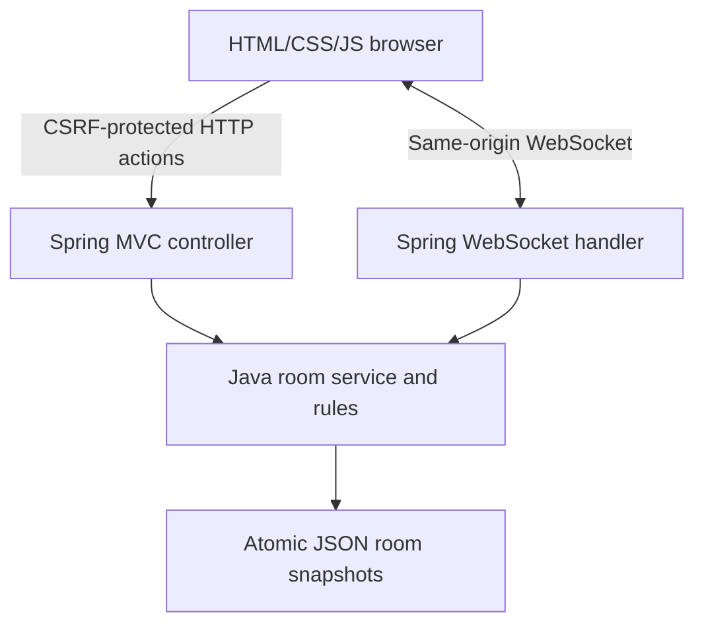

# Architecture

The static frontend, API, login, and WebSocket endpoint share one Spring Boot origin. Embedded Tomcat serves the executable JAR. No Node server or Sites Worker executes backend logic.

## Coordination

Rooms live in a `ConcurrentHashMap`. Each room has a separate Java monitor: `synchronized(room)` serializes actions for that room. Different rooms can execute concurrently. The service publishes room events after releasing its room lock. Each subscriber is sent a role-filtered DTO, and Spring's concurrent-session decorator prevents concurrent socket writes.

Clients reject older room revisions. Canvas revisions separately track geometry. REST accepts game actions; WebSocket pushes state and handles subscribe/heartbeat messages. Client-side pending geometry keeps drawing responsive before acknowledgement. Reconnect obtains a full canvas again, using the same per-tab player token.

## Background jobs

| Job | Interval | Work |
| --- | --- | --- |
| `tick()` | 250 ms fixed delay | Check round/presence deadlines and push changes. |
| `flush()` | 1 second fixed delay | Save dirty room snapshots. |
| `cleanup()` | 60 seconds fixed delay | Remove rooms inactive for more than 24 hours and delete their snapshots. |

Snapshot serialization occurs under the room lock, then file writing occurs outside it. Files are replaced atomically where supported, with a replace fallback. Normal shutdown flushes dirty state. An abrupt crash can lose updates since the last completed snapshot, approximately a second under light load, potentially longer under heavy I/O.

## Security boundaries

Private mode requires a supplied password. The `host` login establishes a Spring Security session. CSRF protects POST actions. The API supplies a CSRF token to the authenticated browser, which includes its reported header. WebSockets use the same-origin session and a first-message player token; tokens are not placed in URL query strings.

The game host is a room role, separate from the shared `host` login name. Room tokens are random and stored per browser tab. Choices, answers, and other session tokens are filtered from DTOs. User text is escaped in the frontend. Health reports no room/player secrets.

## Deployment boundary

This design supports **one Java application instance** with a persistent data directory. Multiple replicas need shared coordination and storage; file snapshots alone do not synchronize independent JVMs. HTTPS and reverse-proxy WebSocket forwarding are required for remote hosting. See [hosting](HOSTING.md).
