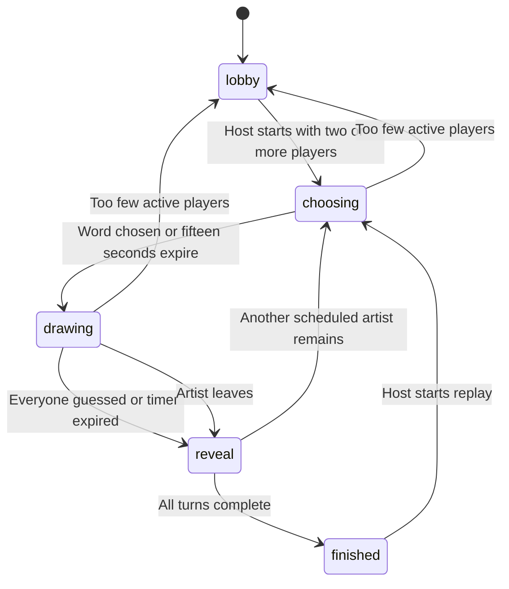

# Game flow

| Phase | Behavior |
| --- | --- |
| `lobby` | Join, chat, configure turns/time, wait for the room host. |
| `choosing` | Artist has 15 seconds to choose one of three words; first choice is selected automatically. |
| `drawing` | Artist draws, others guess, and hints gradually reveal eligible letters. |
| `reveal` | Word becomes public; a six-second intermission precedes the next turn. |
| `finished` | Final scores are shown; host can replay. |

The host selects 1–3 turns per player and 30/60/90-second drawing periods. The game snapshots active players in join order. Departed artists are skipped. Late joiners can guess, and enter the artist schedule when the next game starts.

Guesses are normalized to lowercase alphanumeric characters. Java awards `100 + round(300 × remainingTime / duration)` points to a correct guesser and 75 points to the artist for each success. Players can score once per round; the artist cannot guess. A 450 ms per-player guess cooldown reduces spam.

All active non-artists guessing correctly ends the round immediately. Otherwise the Java scheduler observes the deadline, reveals the word, and pushes the next phase. Timers need no browser polling. The displayed client timer uses the server timestamp, but the Java backend decides outcomes.

Heartbeats are sent every ten seconds. A player unseen for 90 seconds is marked departed. If the host leaves, the first remaining active player becomes host. Closing a socket does not immediately remove a player, allowing refresh/reconnection within the grace period.

If an artist leaves during a game, the round reveals or returns to the lobby when too few active players remain. Replay resets scores and generates a new active-player schedule.
